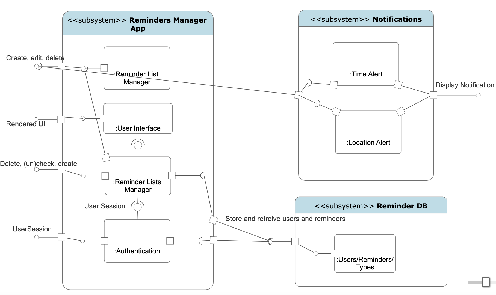

# Design Document

**Author(s)**: David, Moshe and Elibby

## 1 Design Considerations

### 1.1 Assumptions
- **User Authenticity**: It's assumed that users registering on the platform are 
providing genuine information.
- **Stable Environment**: The system is expected to operate in a stable 
environment with minimal disruptions.
- **Active Maintenance**: The software will have regular maintenance and updates 
post-deployment.

1. The app will be used on Android devices.
2. Users will have access to internet connection for real-time database updates.
3. Users have basic knowledge of how to operate an Android device.
4. Users are willing to create and manage multiple reminder lists.
5. Users may need access to their reminders across multiple devices.
6. The app will be designed with a user-friendly and intuitive interface.

### 1.2 Constraints
- **Budget**: The development and deployment must stay within the stipulated 
budget.
- **Time**: There are set milestones that need to be met at specified intervals.
- **Technology**: The system will be developed using the technology stack agreed 
upon during the initial meetings.

1. Development must target the Android operating system, possibly requiring different versions to support various devices.
2. The database must be designed for storing and retrieval of reminder data.
3. The app must adhere to Android design guidelines and best practices.
4. Data privacy and security are critical, especially if the app syncs across devices.
5. The app should consider localization for a global user base.

### 1.3 System Environment
- **Server**: The system will be hosted on cloud servers for better scalability 
and maintenance.
- **Database**: The database is designed to be relational, chosen for its mature 
technology, widespread usage, and compatibility with our system requirements.
- **Client**: End-users will interact with the system via web browsers, mobile 
apps, or other client software.

1. The app will run on Android devices with various screen sizes and resolutions.
2. It will interact with the Android operating system for UI rendering and device features (e.g., notifications).
3. The app will make use of a backend server or cloud services for data storage and synchronization.
4. It will require access to the device's storage for saving user data.
5. Location-based services may be used for location-based reminders.

## 2 Architectural Design

### 2.1 Component Diagram
The system is composed of three primary layers:
1. **Presentation Layer**: This is the user interface (UI) layer. Responsible for 
displaying information to the users and collecting user input.
2. **Business Logic Layer**: Handles data validation, processes data, and enforces 
business rules.
3. **Data Access Layer**: Interacts with data storage systems to retrieve and 
store data.

### 2.2 Deployment Diagram
[Deployment Diagram](https://github.com/qc-se-fall23/370Fall23Sec131Team3/blob/main/GroupProject/Deliverable2/DeploymentDiagram.png)

## 3 Low-Level Design

### 3.1 Class Diagram

[Team 3 UML Design](https://github.com/qc-se-fall23/370Fall23Sec131Team3/blob/main/GroupProject/Design-Team/design.pdf)

### 3.2 Other Diagrams
[Workflow Diagram](https://github.com/qc-se-fall23/370Fall23Sec131Team3/blob/main/GroupProject/Deliverable2/workflow-diagram-design.png)

## 4 User Interface Design

The user interface is designed to be intuitive and user-friendly. The primary 
design consideration is usability. The choice of colors, fonts, and layout is made 
to ensure that the interface is easy on the eyes and information is easily 
readable.
## 4 User Interface Design

App UI Preview:

- **Security Measures**:
  1. **Data Encryption**: All sensitive data, including passwords, are encrypted 
before being stored in the database.
  2. **Authentication and Authorization**: Users are authenticated before 
accessing the system. Once authenticated, their access is based on their role.
  3. **Regular Backups**: Data is backed up regularly to prevent data loss.

  App UI Preview:
[UI Design](https://app.uizard.io/p/2a112080)

Mockup Draft:

Final Basic Mockup:

- The design has four workable UIs
    a. The home screen
    b. The reminder creator screen
    c. The list display screen (within this design, only one list screen is available)
    d. The list creator screen

- The home screen has **three** clickable actions
    - Clicking on the " + new reminder " button will take the user to the reminder creation screen
    - The "Placeholder D" button directly takes the user to that list's display screen
    - Users also have access to a search bar and an add list button

- The reminder creation screen has **one** clickable action 
    - The "create reminder " which creates and adds a user's reminder to a list of their choice
    (they also have the freedom to also create a new list here from the drop down)
    - Users also have the option to set the reminder to repeat
    - The user can also include a description for their reminder

- The list reminder screen has **one** workable action
    - A user can also add a reminder from an given list's screen
    - The display shows that within the list, users are able to toggle on and off repeat alerts
    and given an options menu (which will contain tasks such as edit, delete, rename, etc.)
    - There is also a check mark function that allows users to check and uncheck tasks
    - Users can also delete the list from its respective display screen

- The list creator screen has **one** workable actions
    - A user can click the "Add List" button on the home screen and it will redirect them to the
    list creator screen
    - The function of this screen is very simple, users are able to input the name of the list they
    want to create and then press the create list button
    - Once a list is created, users are directed back to the home screen where the new list will 
    appear

## 5 Conclusion

With this Design Document, We have detailed the principal architectural and design 
decisions for our system. Think of it as a guiding tool for developers, 
simplifying the comprehension and further contribution to our project. As we move 
forward, I'll make sure to update this document to echo any significant changes in 
our design approach.
