# Combined User Manual for ReminderManager
## Introduction

Welcome to ReminderManager, a user-friendly Android app designed to keep 
track of life's essential tasks, big or small. This simple app offers 
dedicated lists, intuitive interfaces, and even allows you to set up 
repetitive alarms for any task.

## Installation

1. **Download the App**: Find ReminderManager on the Google Play Store.
2. **Install the App**: Follow the on-screen instructions after opening 
the downloaded file.

## Getting Started

### Registering and Logging onto Reminder Manager

ReminderManager requires you to register an account before using the app. 
This process is quick, hassle-free, and free.

1. Open the app and press "click to register" under the login button.

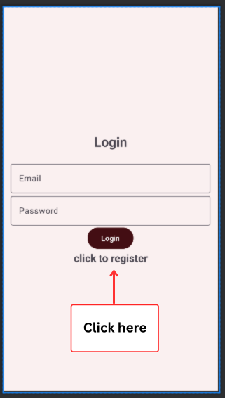

2. On the register screen, create a username and password.

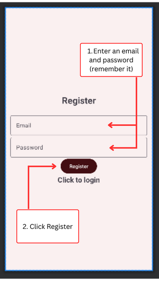

3. Click Register and return to the login screen.
4. Enter your credentials and press login.

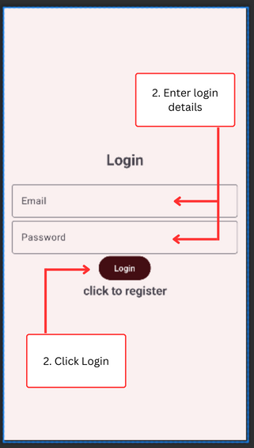

5. Upon successful login, you'll reach the app's homepage.

### Creating A Reminder

1. Tap "+ New Reminder" under the search bar or on any list screen.

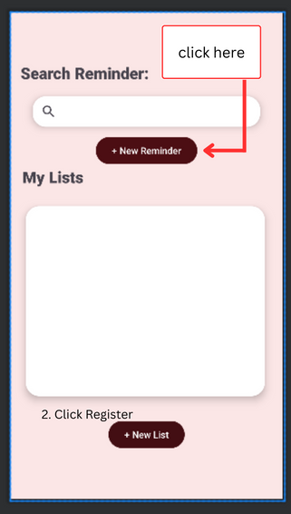

2. In the New Reminder Screen, fill in the reminder name, select a list from the dropdown menu, and description.

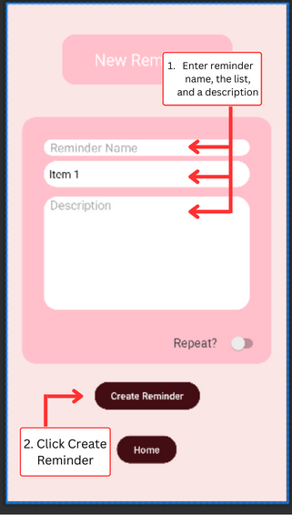

3. Press "create reminder" to add it to the list.
4. You will then be taken to the chosen list and the reminder will show up underneath it.

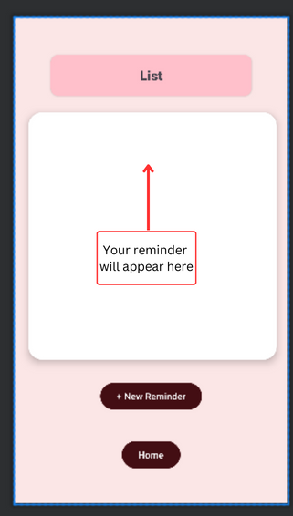

#### Creating Reminders Inside A List

A reminder can also be created on any list screen. 

1. On the home screen, click on any list under My Lists
2. You will be directed to the chosen list's screen
3. Press "+ New Reminder".

### Creat A New List

1. On the home screen, press "+ New List".

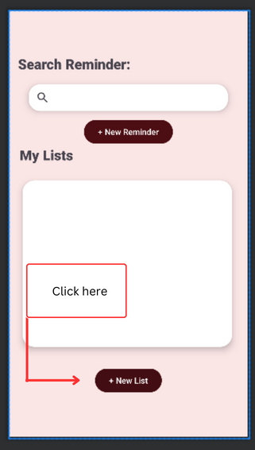

2. Enter the List Name and press "Create List".

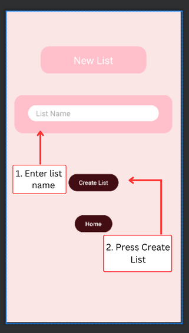

3. You will be redirected to the List Screen of the list you just created. There you can start adding reminders to the list. The list will also appear on the homescreen.

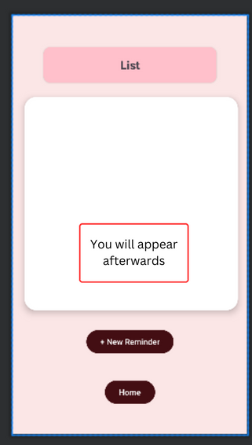

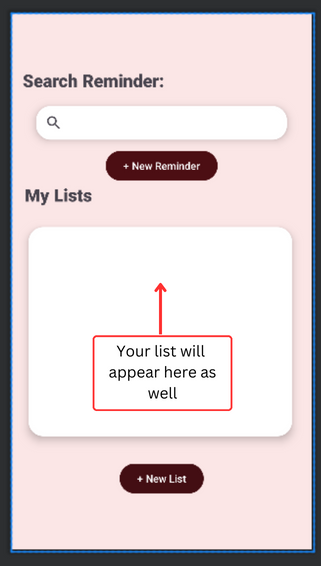

### Reminder Actions

On the list screen, you can edit, delete, and update any reminder.

### List Actions

Lists can be deleted from the list screen.
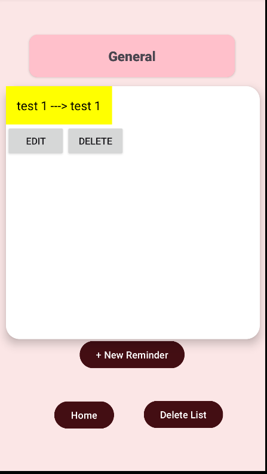

### Searching 

1. Click the search bar on the home screen

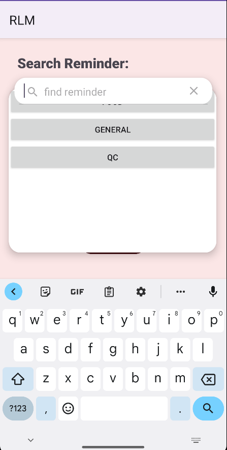

2. Type in the reminder you want to look for. If you do not remember the full name of the reminder, a list of reminders that contain your input will show up when you press enter.

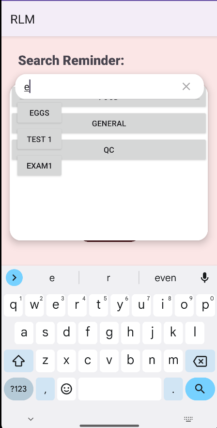

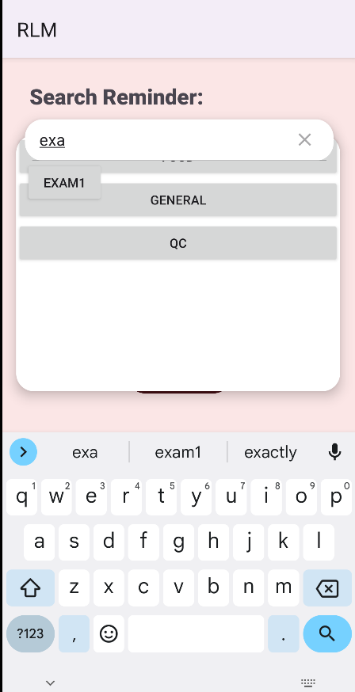

3. Select desired reminder.
4. You will be taken to the list page containing that reminder.

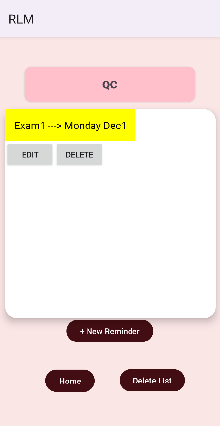

## Troubleshooting and FAQ

- **Login Issues**: Verify your credentials or use 'Forgot Password'.
- **Saving Issues**: Check app permissions for device storage.
- **Q: Can I share reminders?** A: Currently, the app supports individual 
use only.
- **Q: Is there a limit on reminders?** A: You can create an unlimited 
number.

## Support

For assistance or reporting issues, contact 
[support@remindermanager.com](mailto:support@remindermanager.com).

## Conclusion

Thank you for choosing ReminderManager. We aim to enhance your 
organization and punctuality.

